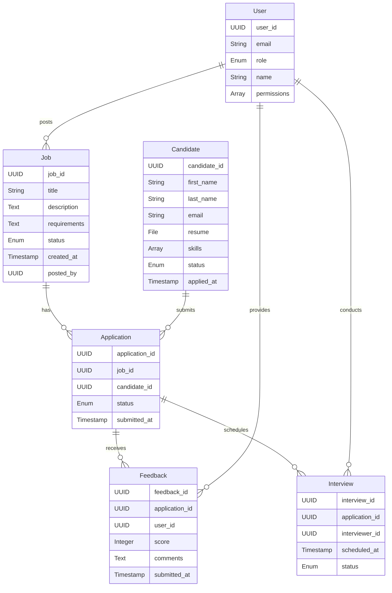
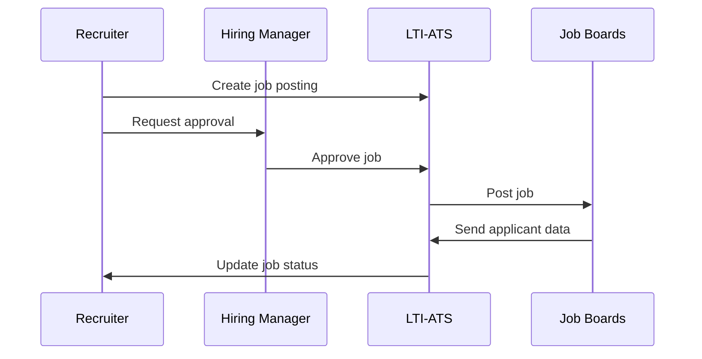
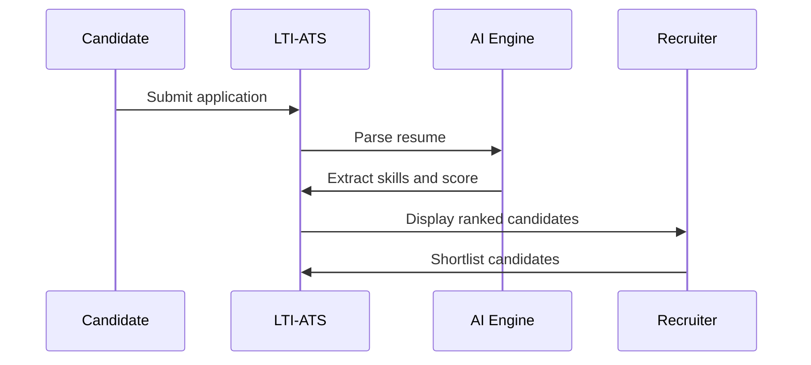
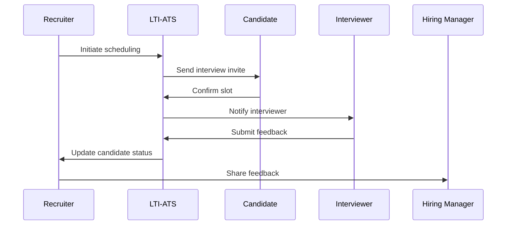
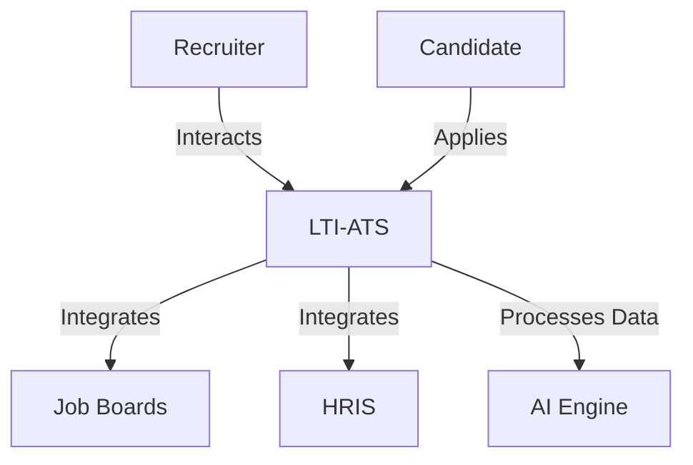

# LTI Applicant Tracking System (LTI-ATS) Design Document

*Generated by Grok, created by xAI, on July 07, 2025, at 04:55 PM CST*

## Overview of LTI-ATS

### Brief Description
LTI-ATS is a next-generation Applicant Tracking System designed to revolutionize recruitment for organizations of all sizes. Built with a focus on efficiency, collaboration, automation, and AI assistance, LTI-ATS streamlines the hiring process, enhances candidate experience, and empowers HR teams to make data-driven decisions. It integrates seamlessly with modern HR tools, prioritizes security and scalability, and leverages AI to reduce bias and optimize workflows.

### Added Value and Competitive Advantages
- **Efficiency for HR Departments**: Automates repetitive tasks like resume screening, interview scheduling, and candidate communication, reducing time-to-hire by up to 30% (inspired by industry benchmarks like BambooHR’s reported efficiency gains).
- **Real-Time Collaboration**: Enables seamless interaction between recruiters, hiring managers, and interviewers with shared candidate profiles, real-time feedback, and integrated communication tools.
- **Advanced AI Assistance**: Uses machine learning (ML) and natural language processing (NLP) to match candidates to roles, generate job descriptions, and provide predictive analytics for hiring success.
- **Scalability and Security**: Cloud-based architecture with GDPR-compliant data encryption, role-based access control, and scalable infrastructure to handle high applicant volumes.
- **User-Centric Design**: Intuitive interface with mobile accessibility and customizable workflows to cater to diverse industries and organizational needs.
- **Competitive Edge**: Combines ATS and Candidate Relationship Management (CRM) functionalities, offering a unified platform for recruitment and talent nurturing, unlike traditional ATS systems that focus solely on applicant tracking.

## Basic Functionalities of an ATS (Prioritized)

1. **Job Posting and Distribution**:
   - **Description**: Allows recruiters to create, customize, and post job openings to multiple platforms (e.g., job boards, social media, company career pages).
   - **Priority**: High, as it initiates the recruitment process and maximizes candidate reach.
2. **Resume Parsing and Candidate Management**:
   - **Description**: Automatically extracts data from resumes, organizes candidate profiles, and stores them in a searchable database.
   - **Priority**: High, as it centralizes applicant data and enables efficient screening.
3. **Candidate Screening and Filtering**:
   - **Description**: Uses keyword matching, AI-driven scoring, and customizable filters to rank and shortlist candidates based on job requirements.
   - **Priority**: High, as it reduces manual effort in identifying qualified candidates.
4. **Interview Scheduling**:
   - **Description**: Automates scheduling by integrating with calendars, sending invites, and managing interview logistics.
   - **Priority**: Medium, as it streamlines coordination but depends on candidate selection.
5. **Collaboration Tools**:
   - **Description**: Facilitates communication and feedback sharing among recruiters, hiring managers, and interviewers via notes, scorecards, and messaging.
   - **Priority**: Medium, as it enhances team coordination but is secondary to core recruitment tasks.
6. **Reporting and Analytics**:
   - **Description**: Generates insights on metrics like time-to-hire, source effectiveness, and diversity compliance.
   - **Priority**: Medium, as it supports strategic decisions but is less critical for daily operations.
7. **Candidate Communication**:
   - **Description**: Automates emails, status updates, and personalized messages to candidates, improving their experience.
   - **Priority**: Medium, as it enhances candidate engagement but relies on prior steps.
8. **Onboarding Integration**:
   - **Description**: Transfers candidate data to HRIS for seamless onboarding, including digital offer letters and policy signing.
   - **Priority**: Low, as it occurs post-hiring but is valuable for end-to-end process integration.

## Benefits of Using LTI-ATS

### For Candidates
- **Streamlined Application Process**: User-friendly interfaces and mobile accessibility simplify applying for jobs.
- **Timely Communication**: Automated updates keep candidates informed, enhancing their experience and perception of the employer brand.
- **Fair Evaluation**: AI-driven screening reduces bias by focusing on skills and qualifications.
- **Engagement**: CRM features maintain relationships with candidates for future opportunities.

### For Recruiters
- **Time Savings**: Automation of repetitive tasks (e.g., resume screening, scheduling) reduces administrative burden by up to 25 hours per recruiter, as seen in cases like Okta’s Greenhouse implementation.
- **Data-Driven Decisions**: Analytics provide insights into hiring metrics, improving strategy and efficiency.
- **Collaboration**: Real-time tools enable faster feedback and decision-making among teams.
- **Scalability**: Handles high applicant volumes, suitable for growing organizations.

## Alternatives to ATS and Their Relevance

1. **Manual Processes (Spreadsheets, Email)**:
   - **Description**: Using tools like Excel or Google Sheets to track applicants and email for communication.
   - **Relevance**: Suitable for very small businesses (<50 employees) with low hiring volumes (<10 applicants/month) where ATS costs may outweigh benefits.
   - **Drawbacks**: Error-prone, time-consuming, and unscalable for larger applicant pools.
2. **HRIS with Basic Recruitment Modules**:
   - **Description**: HR systems like BambooHR or Workday with built-in recruitment features.
   - **Relevance**: Ideal for organizations already using an HRIS, needing basic tracking without a standalone ATS.
   - **Drawbacks**: Limited functionality compared to dedicated ATS systems.
3. **Job Board Tools**:
   - **Description**: Platforms like LinkedIn or Indeed with built-in applicant tracking.
   - **Relevance**: Useful for startups or SMEs focusing on specific job boards with minimal integration needs.
   - **Drawbacks**: Lack of centralized candidate management and advanced analytics.
4. **Outsourced Recruitment (RPO)**:
   - **Description**: Hiring external agencies to manage recruitment.
   - **Relevance**: Relevant for companies with no internal HR team or during high-volume hiring surges.
   - **Drawbacks**: Higher costs and less control over the process.

## Typical Customer Journey for an ATS Client

1. **Discovery and Evaluation**:
   - **Interaction**: The client identifies recruitment challenges (e.g., high applicant volume, slow hiring) and researches ATS solutions via demos, reviews, or peer recommendations (e.g., Capterra).
   - **Actors**: HR manager, IT team.
2. **Vendor Selection**:
   - **Interaction**: The client compares LTI-ATS with competitors (e.g., Greenhouse, Lever) based on features, pricing, and support. They request a demo and assess integration capabilities.
   - **Actors**: HR manager, procurement team.
3. **Implementation**:
   - **Interaction**: The client signs up, migrates data (e.g., candidate resumes, job templates), configures workflows, and trains staff via LTI’s support team and workshops.
   - **Actors**: HR team, IT team, LTI support.
4. **Usage**:
   - **Interaction**: Recruiters post jobs, screen candidates, schedule interviews, and collaborate with hiring managers. Candidates apply via career pages and receive automated updates.
   - **Actors**: Recruiters, hiring managers, candidates.
5. **Optimization and Feedback**:
   - **Interaction**: The client uses analytics to monitor metrics (e.g., time-to-hire) and provides feedback to LTI for system improvements. LTI offers ongoing support via email, chat, or phone.
   - **Actors**: HR team, LTI support.
6. **Scaling**:
   - **Interaction**: As the client grows, LTI-ATS scales to handle increased applicant volumes and integrates with new tools (e.g., payroll systems).
   - **Actors**: HR team, IT team.

## User Roles, Actions, and Dependencies

1. **Recruiter**:
   - **Actions**:
     - Create and post job openings.
     - Screen and rank candidates using AI tools.
     - Schedule interviews and send communications.
     - Generate reports on hiring metrics.
   - **Dependencies**:
     - Job creation depends on hiring manager’s approval.
     - Screening relies on candidate applications.
     - Scheduling requires hiring manager and interviewer availability.
2. **Hiring Manager**:
   - **Actions**:
     - Approve job postings.
     - Review candidate profiles and provide feedback.
     - Participate in interviews and submit scorecards.
   - **Dependencies**:
     - Feedback depends on recruiter’s shortlisted candidates.
     - Interview participation relies on scheduler’s coordination.
3. **Interviewer**:
   - **Actions**:
     - Conduct interviews and submit feedback via scorecards.
     - View candidate profiles and interview kits.
   - **Dependencies**:
     - Actions depend on recruiter’s scheduling and candidate data.
4. **Candidate**:
   - **Actions**:
     - Apply for jobs via career pages.
     - Receive and respond to communications (e.g., interview invites).
     - Complete assessments or onboarding forms.
   - **Dependencies**:
     - Application depends on job postings.
     - Responses rely on recruiter’s communications.
5. **Admin (IT/HR Admin)**:
   - **Actions**:
     - Configure system settings (e.g., workflows, integrations).
     - Manage user roles and permissions.
     - Monitor system performance and security.
   - **Dependencies**:
     - Configuration depends on organizational requirements.
     - Permissions rely on user role definitions.

## Data Model

### Entities, Attributes, and Relationships

#### Entities and Attributes
1. **Job**:
   - **Attributes**:
     - `job_id` (UUID, Primary Key)
     - `title` (String)
     - `description` (Text)
     - `requirements` (Text)
     - `status` (Enum: Open, Closed, Draft)
     - `created_at` (Timestamp)
     - `posted_by` (UUID, Foreign Key to User)
2. **Candidate**:
   - **Attributes**:
     - `candidate_id` (UUID, Primary Key)
     - `first_name` (String)
     - `last_name` (String)
     - `email` (String)
     - `resume` (File)
     - `skills` (Array of Strings)
     - `status` (Enum: Applied, Screened, Interviewed, Hired, Rejected)
     - `applied_at` (Timestamp)
3. **Application**:
   - **Attributes**:
     - `application_id` (UUID, Primary Key)
     - `job_id` (UUID, Foreign Key to Job)
     - `candidate_id` (UUID, Foreign Key to Candidate)
     - `status` (Enum: Submitted, Reviewed, Shortlisted, Rejected)
     - `submitted_at` (Timestamp)
4. **User**:
   - **Attributes**:
     - `user_id` (UUID, Primary Key)
     - `email` (String)
     - `role` (Enum: Recruiter, Hiring Manager, Interviewer, Admin)
     - `name` (String)
     - `permissions` (Array of Strings)
5. **Feedback**:
   - **Attributes**:
     - `feedback_id` (UUID, Primary Key)
     - `application_id` (UUID, Foreign Key to Application)
     - `user_id` (UUID, Foreign Key to User)
     - `score` (Integer)
     - `comments` (Text)
     - `submitted_at` (Timestamp)
6. **Interview**:
   - **Attributes**:
     - `interview_id` (UUID, Primary Key)
     - `application_id` (UUID, Foreign Key to Application)
     - `interviewer_id` (UUID, Foreign Key to User)
     - `scheduled_at` (Timestamp)
     - `status` (Enum: Scheduled, Completed, Canceled)

#### Relationships
- **Job ↔ Application**: One-to-Many (One job has many applications).
- **Candidate ↔ Application**: One-to-Many (One candidate can apply to multiple jobs).
- **User ↔ Job**: Many-to-One (Many users can post jobs, but one job is posted by one user).
- **Application ↔ Feedback**: One-to-Many (One application can have multiple feedback entries).
- **Application ↔ Interview**: One-to-Many (One application can have multiple interviews).
- **User ↔ Feedback**: Many-to-One (Many users can provide feedback, but one feedback is from one user).
- **User ↔ Interview**: Many-to-One (Many users can conduct interviews, but one interview is conducted by one user).

#### Data Model Diagram
**Visual Representation Description**: This Entity-Relationship (ER) diagram visually depicts the relationships between the core entities of LTI-ATS: Job, Candidate, Application, User, Feedback, and Interview. Each entity is represented as a rectangular box listing its attributes (e.g., `job_id`, `title` for Job). Relationships are shown with lines connecting entities, using crow’s foot notation (e.g., `||--o{` for one-to-many). For example, a Job is linked to multiple Applications, and an Application is linked to one Candidate. The diagram organizes entities in a way that highlights their dependencies, making it easy to understand the data structure and relationships.




## Lean Canvas

**Visual Representation Description**: The Lean Canvas diagram is a flowchart that organizes the business model of LTI-ATS into nine key components: Problem, Solution, Customer Segments, Unique Value Proposition, Key Metrics, Channels, Revenue Streams, Cost Structure, and Unfair Advantage. Each component is represented as a node with brief descriptions (e.g., “Problem: Slow hiring processes”). Arrows connect related components, such as Problem leading to Solution, to show logical flow. The visual layout is a directed graph, making it easy to see how LTI-ATS addresses recruitment challenges and creates value.


```mermaid
graph TD
    A[Problem<br>- Slow hiring processes<br>- Poor collaboration<br>- Manual repetitive tasks] --> B[Solution<br>- AI-driven ATS<br>- Real-time collaboration<br>- Automation of tasks]
    A --> C[Customer Segments<br>- SMEs<br>- Enterprises<br>- Staffing agencies]
    B --> D[Unique Value Proposition<br>Streamlined, AI-powered hiring with seamless collaboration]
    B --> E[Key Metrics<br>- Time-to-hire<br>- Candidate satisfaction<br>- Hiring cost reduction]
    C --> F[Channels<br>- Website<br>- Demos<br>- Industry events]
    D --> G[Revenue Streams<br>- Subscription (SaaS)<br>- Enterprise licensing]
    C --> H[Cost Structure<br>- Development<br>- Cloud hosting<br>- Support]
    D --> I[Unfair Advantage<br>- AI and CRM integration<br>- Scalable cloud architecture]
```

### Lean Canvas Explanation
- **Problem**: Slow hiring, poor collaboration, and manual tasks burden HR teams.
- **Solution**: LTI-ATS automates tasks, enhances collaboration, and uses AI for smarter hiring.
- **Customer Segments**: Targets SMEs, enterprises, and staffing agencies needing efficient recruitment.
- **Unique Value Proposition**: A streamlined, AI-powered ATS with CRM capabilities for better hiring outcomes.
- **Key Metrics**: Measures time-to-hire, candidate satisfaction, and cost reduction.
- **Channels**: Reaches customers via website, demos, and industry events.
- **Revenue Streams**: Monthly/annual subscriptions and enterprise licensing.
- **Cost Structure**: Includes development, cloud hosting, and customer support.
- **Unfair Advantage**: Advanced AI and integrated CRM set LTI-ATS apart from competitors.

## Main Use Cases

### Use Case 1: Job Posting and Distribution
- **Description**: A recruiter creates and posts a job opening to multiple platforms.
- **Actors**: Recruiter, Hiring Manager, Job Boards.
- **Steps**:
  1. Recruiter logs into LTI-ATS and creates a job with title, description, and requirements.
  2. Hiring Manager reviews and approves the job.
  3. Recruiter posts the job to internal career pages and external job boards (e.g., LinkedIn, Indeed).
  4. System tracks applicant sources and updates the job status.
- **Visual Representation Description**: This sequence diagram illustrates the job posting process as a series of interactions between the Recruiter, Hiring Manager, LTI-ATS, and Job Boards. Vertical lifelines represent each actor, and horizontal arrows show the flow of actions (e.g., “Create job posting” from Recruiter to LTI-ATS). The sequence is chronological, with annotations like “Request approval” and “Post job” clarifying the steps. The diagram visually emphasizes the collaborative and automated nature of job distribution.




### Use Case 2: Candidate Screening and Ranking
- **Description**: The system screens and ranks candidates based on job requirements.
- **Actors**: Recruiter, Candidate, AI Engine.
- **Steps**:
  1. Candidate applies via career page, uploading a resume.
  2. AI Engine parses resume and extracts skills, experience, and qualifications.
  3. AI Engine scores candidates against job requirements.
  4. Recruiter reviews ranked candidates and shortlists top matches.
- **Visual Representation Description**: This sequence diagram shows the candidate screening process with lifelines for the Candidate, LTI-ATS, AI Engine, and Recruiter. Arrows depict the flow from application submission to resume parsing, scoring, and shortlisting. For example, “Parse resume” from LTI-ATS to AI Engine and “Display ranked candidates” to Recruiter highlight the AI-driven automation. The visual layout, as depicted in the provided image, clarifies the interaction between human and system components, emphasizing terms like “applicant,” “resume parsing,” “rank,” and “talent acquisition.”




### Use Case 3: Interview Scheduling and Feedback
- **Description**: The system schedules interviews and collects feedback.
- **Actors**: Recruiter, Hiring Manager, Interviewer, Candidate.
- **Steps**:
  1. Recruiter selects shortlisted candidates and initiates scheduling.
  2. System integrates with calendars to propose interview times.
  3. Candidate confirms interview slot.
  4. Interviewer conducts interview and submits feedback via scorecard.
  5. Recruiter reviews feedback and updates candidate status.
- **Visual Representation Description**: This sequence diagram visualizes the interview scheduling and feedback process with lifelines for Recruiter, LTI-ATS, Candidate, Interviewer, and Hiring Manager. Arrows show the flow from initiating scheduling to feedback submission, such as “Send interview invite” from LTI-ATS to Candidate and “Submit feedback” from Interviewer to LTI-ATS. The diagram highlights the automated scheduling and collaborative feedback collection.




## High-Level System Design

### System Architecture
LTI-ATS is a cloud-based, microservices architecture deployed on AWS, ensuring scalability, security, and maintainability. It follows a modular design with RESTful APIs for communication and integrates with external systems like job boards, HRIS, and calendar tools.

#### Components
1. **Frontend**:
   - **Tech**: React.js with Tailwind CSS for responsive, user-friendly interfaces.
   - **Function**: Provides dashboards for recruiters, hiring managers, and admins; candidate-facing career pages.
2. **Backend**:
   - **Tech**: Node.js with Express for API services, Python with FastAPI for AI/ML tasks.
   - **Function**: Handles business logic, data processing, and AI-driven features (e.g., resume parsing, candidate scoring).
3. **Database**:
   - **Tech**: PostgreSQL for structured data, MongoDB for unstructured resume data.
   - **Function**: Stores candidate profiles, job postings, and feedback.
4. **AI Engine**:
   - **Tech**: TensorFlow for ML models, NLTK/Spacy for NLP.
   - **Function**: Parses resumes, matches candidates, and generates analytics.
5. **Integration Layer**:
   - **Tech**: REST APIs and webhooks.
   - **Function**: Connects with job boards (e.g., LinkedIn), HRIS (e.g., Workday), and calendar tools (e.g., Google Calendar).
6. **Cache**:
   - **Tech**: Redis.
   - **Function**: Caches frequently accessed data (e.g., candidate profiles) for faster retrieval.
7. **Queue**:
   - **Tech**: RabbitMQ.
   - **Function**: Manages asynchronous tasks like email notifications and job postings.
8. **Load Balancer**:
   - **Tech**: AWS Elastic Load Balancer.
   - **Function**: Distributes traffic across microservices for scalability.
9. **CDN**:
   - **Tech**: AWS CloudFront.
   - **Function**: Delivers static assets (e.g., career page content) with low latency.
10. **Security**:
    - **Tech**: AWS IAM, encryption (AES-256), OAuth2 for authentication.
    - **Function**: Ensures GDPR compliance, role-based access, and data protection.

#### Communication Patterns
- **Synchronous**: REST APIs for real-time interactions (e.g., job posting, candidate search).
- **Asynchronous**: Message queues (RabbitMQ) for tasks like email sending and job distribution.
- **Event-Driven**: Webhooks for external system integrations (e.g., job board updates).

#### System Design Diagram
**Visual Representation Description**: This flowchart illustrates the high-level architecture of LTI-ATS as a series of interconnected components. The diagram shows users interacting via HTTPS with a CloudFront CDN and Elastic Load Balancer, which routes traffic to Frontend and API Gateway services. The API Gateway connects to Backend and AI Services, which interact with PostgreSQL, MongoDB, Redis, and RabbitMQ. External systems (e.g., Job Boards, HRIS) are linked via integrations. Arrows indicate data flow, such as from Backend to Databases or from Queue to Email Service, providing a clear visual of the system’s modular and scalable design.


```mermaid
graph TD
    A[User (Recruiter/Candidate)] -->|HTTPS| B[CloudFront CDN]
    B -->|Static Assets| C[S3 Bucket]
    A -->|HTTPS| D[Elastic Load Balancer]
    D --> E[Frontend Service (React)]
    D --> F[API Gateway]
    F --> G[Backend Service (Node.js)]
    F --> H[AI Service (Python)]
    G --> I[PostgreSQL Database]
    G --> J[MongoDB]
    G --> K[Redis Cache]
    G --> L[RabbitMQ Queue]
    H --> M[TensorFlow/NLP Models]
    G --> N[External Systems (Job Boards, HRIS)]
    L --> O[Email Service]
    F --> P[Authentication Service (OAuth2)]
```

### Scalability and Security
- **Scalability**: Microservices allow independent scaling of components. AWS Auto Scaling adjusts resources based on load.
- **Security**: Data encryption (AES-256), role-based access via AWS IAM, and GDPR compliance ensure candidate data protection.
- **Maintainability**: Modular design and CI/CD pipelines (using Jenkins) enable rapid updates and bug fixes.

## C4 Diagram (AI Engine Component)

### Context Diagram
**Visual Representation Description**: This C4 context diagram provides a high-level view of LTI-ATS and its interactions with external entities. The LTI-ATS system is a central node connected to Recruiter, Candidate, Job Boards, HRIS, and the AI Engine. Arrows indicate interactions, such as Recruiter and Candidate interacting with LTI-ATS, and LTI-ATS integrating with Job Boards and HRIS. The AI Engine is shown as a key internal component, visually emphasizing its role in processing data.




### Container Diagram (AI Engine)
**Visual Representation Description**: This C4 container diagram zooms into the AI Engine within LTI-ATS, showing its sub-components: Resume Parser, Candidate Matcher, and Analytics Generator. These are connected to MongoDB (for resume data) and PostgreSQL (for job/candidate data). Arrows show data flow, such as Resume Parser storing data in MongoDB and Candidate Matcher reading from PostgreSQL. The AI Engine connects to the Backend Service via REST API, with the visual layout reflecting components like TensorFlow, Python, and SpaCy as depicted in the provided image.


```mermaid
graph TD
    A[LTI-ATS System] --> B[AI Engine Container]
    B --> C[Resume Parser (Python, Spacy)]
    B --> D[Candidate Matcher (TensorFlow)]
    B --> E[Analytics Generator (Python)]
    C --> F[MongoDB (Resume Data)]
    D --> G[PostgreSQL (Job/Candidate Data)]
    E --> G
    B -->|REST API| H[Backend Service]
```

### Component Diagram (AI Engine)
**Visual Representation Description**: This C4 component diagram details the AI Engine’s internal structure, showing sub-components like Resume Parser (with Spacy NLP Model and Resume Data Processor), Candidate Matcher (with TensorFlow ML Model and Scoring Algorithm), and Analytics Generator (with Analytics Engine and Report Generator). Arrows indicate data interactions, such as Resume Parser storing data in MongoDB and Candidate Matcher reading/writing to PostgreSQL. The visual layout highlights the modular design of the AI Engine for resume parsing, candidate scoring, and analytics.

```mermaid
graph TD
    A[AI Engine] --> B[Resume Parser]
    A --> C[Candidate Matcher]
    A --> D[Analytics Generator]
    B --> E[Spacy NLP Model]
    B --> F[Resume Data Processor]
    C --> G[ML Model (TensorFlow)]
    C --> H[Scoring Algorithm]
    D --> I[Analytics Engine]
    D --> J[Report Generator]
    B -->|Stores| K[MongoDB]
    C -->|Reads| L[PostgreSQL]
    D -->|Reads/Writes| L
```

### Explanation
The AI Engine is a critical component, handling resume parsing, candidate matching, and analytics. It uses Python with Spacy for NLP-based resume parsing, TensorFlow for ML-driven candidate scoring, and custom analytics for recruitment insights. It interacts with MongoDB for unstructured resume data and PostgreSQL for structured data, ensuring efficient data processing and scalability.

---